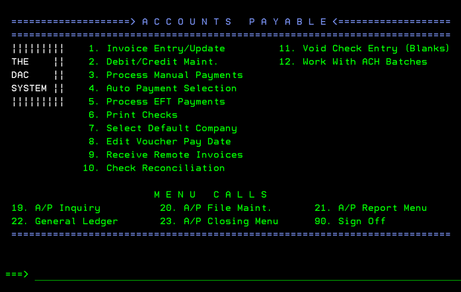
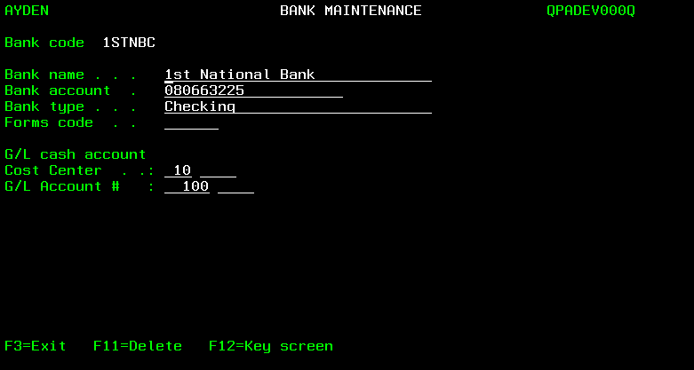
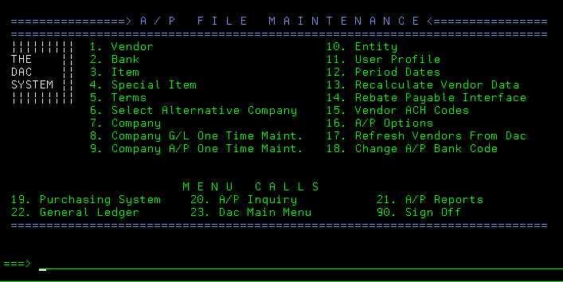
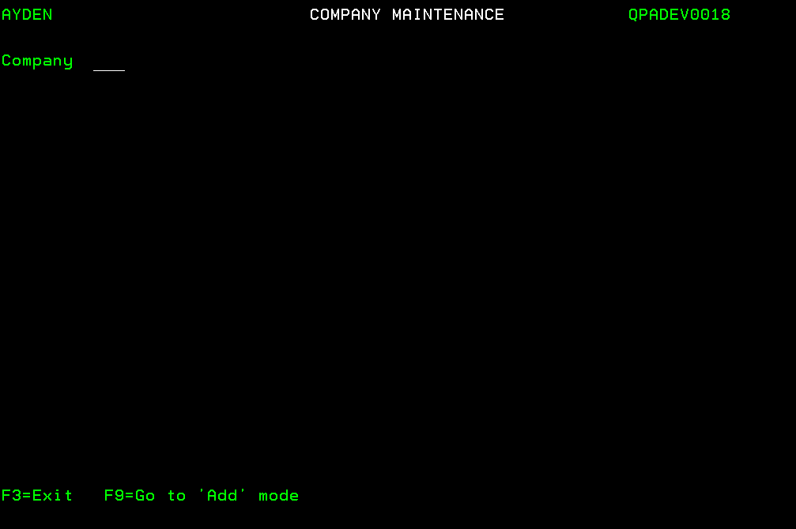

# Preface

Before “getting started” with DAC Accounts Payable (A/P) System, users should refer to the Introduction of the Getting Started document for information about DAC data, screens and menus.

After selecting option 11 (Accounts Payable) of the DAC Main Operations Menu screen, the Accounts Payable screen appears.

Users can press \<F3> to redisplay the Main Operations Menu screen.

Refer to the Accounts Payable Quick Reference Guide for an overview of the use of the Accounts Payable System.

For information about transferring purchase orders to Accounts Payable, and the report which is printed when transfers occur, refer to Transferring Purchase Orders To Accounts Payable of the Purchasing document.

## Getting started with Accounts Payable

The steps below are followed to create the necessary records before the Accounts Payable System is used. If the DAC General Ledger System is used (or only the General Ledger account numbers are used), the steps below must not be taken until:

- The cost center number(s) and General Ledger account numbers are defined. Refer to the General Ledger document for information about using the G/L File Maintenance applications to add cost center and G/L account records.

- The cost center number(s) and General Ledger account numbers are combined using the Work With Cost Center application.

Note: The General Ledger System is used by selecting option 22 (General Ledger) of the Accounts Payable screen, or by selecting option 12 (General Ledger) of the DAC Main Operations Menu screen.

**Step 1**: Use the Work With System Options application to make any necessary
changes to the value of the default system option record fields related to Accounts
Payable. Refer to the DAC Default System Options document for information about
the A/P Interface Active? and A/P Terms Positions Used fields of the SYS005
default system option, and the Accounts Payable Active? field of the SYS015 default
system option.

**Step 2**: Use the Company Maintenance screens to add preliminary data, such as
name and address, of the company. Multiple companies must be set up if users track
retained earnings or net profit and loss for more than one entity, such as multiple
warehouses or divisions. Refer to Working With Company Records for additional
information. Note: This step is not necessary if the company records were previously
added using the General Ledger System.

**Step 3**: Use the User Profile Maintenance screen to designate the names of A/P
users, and with which company each user works. Refer to Working With User Profile
Records for additional information. Note: This step is not necessary if the user profile
records were previously added using the General Ledger System.

**Step 4**: Sign off the DAC system, then sign back on.

**Step 5**: Use the Company Maintenance (A/P) screen to add company A/P data,
such as the aging method used by a company. Refer to Working With Company A/P
Options for additional information.

**Step 6**: Use the Company Maintenance (G/L) screen to add company G/L data if
General Ledger account numbers are used. Refer to Working With Company G/L
Options for additional information. Note: This step is not necessary if the company
G/L options were previously added using the General Ledger System.

**Step 7**: Use the Period Date Maintenance screen to add period date data. Refer to
Working With Period Date Records for additional information. Note: This step is not
necessary if the period date records were previously added using the General Ledger
System

**Step 8**: Use the Period Date Inquiry screen to verify the starting and ending dates of
the periods (also referred to as months) of the user’s fiscal year. Refer to Displaying
Period Date Records for additional information.

**Step 9**: Use the Period Status Inquiry screen to verify the A/P open status for the periods of the user’s fiscal year. Refer to Displaying Period Status Records for additional information.

**Step 10**: Contact CDR support personnel who will assist users with the execution of the Company A/P One Time Maintenance application.

**Step 11**: Use the Bank Maintenance screen to add bank data. Refer to Working With Bank Records for additional information.

**Step 12**: Use the Vendor Terms Maintenance screen to add terms data. Refer to Working With Terms Records for additional information.

**Step 13**: Use the Vendor Maintenance screen to add vendor data. Refer to Working
With Vendor Records for additional information.

**Step 14**: Use the Item Maintenance screen to add A/P item data. Refer to Working
With A/P Item Records for additional information.

**Step 15**: Use the Work With A/P Options screen to designate various defaults
(company, terms, bank and pay date) and A/P related options. Refer to Working With
A/P Options for additional information.

**Step 16**: Use the Vendor Maintenance screen to add data concerning recurring payments. Refer to Working With Recurring Invoice Records for additional information.
>Note: The Special Item application (option 4 of the A/P File Maintenance screen) and Entity application (option 10 of the A/P File Maintenance screen) are no longer used due to system upgrades.

Refer to the Accounts Payable Quick Reference Guide for an overview of the use of the Accounts Payable System

## Accounts Payable and General Ledger Account Numbers

If the DAC General Ledger (G/L) System is used, credit and debit journal entries are created when invoice batches are posted and payments are processed.

### Posting invoice batches

The General Ledger account number which is credited when invoice batches are posted is designated by the A/P account number field (see below) of the company A/P options

Refer to Working With Company A/P Options for additional information.

The various G/L account numbers which are debited when invoice batches are posted are designated by a user-named field (see below) of the A/P item records. Refer to Working With A/P Item Records for additional information.

>Note: The specific name of this A/P item record field is designated by the value of the **Account header** field (see below) of a company’s G/L options. Refer to Working With Company G/L Options for additional information.

When invoice batches are posted, a single debit journal entry is created in G/L for each detail line of an invoice.
Refer to Working With Company A/P Options for information about the:

- **Inv jrnl entry method** field which is used to designate if a single credit journal entry is created for each invoice of a batch, or for the entire batch.

- Dates used for debit and credit journal entries when posting invoice batches.

### Processing Payments

Payment processing includes:

- Using the Print Checks application to print checks for a payment batch.
- Using the Process Manual Payments application to enter data concerning payments made with hand-written checks.
- Using the Process EFT Payments application to enter data concerning payments made with electronic funds transfers (EFTs).

The General Ledger account number which is debited when payments are processed is designated by the A/P account number field (see below) of the company A/P options.

Refer to Working With Company A/P Options for additional information. The G/L account numbers which are credited when payments are processed (also referred to as the cash account number and the discount number) are designated by the following fields:

- **Cost Center** and **G/L Account** # fields (see below) of the bank records. Refer to Working With Bank Records for additional information.

    

>Note: The specific names of these bank record fields are designated by the values of the Cost cntr hdr and Account header fields of a company’s G/L options (as described above)

- **Discount account** field (see below) of the company A/P options.

    
Refer to Working With Company A/P Options for additional information.

When payments are processed, a single credit journal entry is created in G/L (for both the cash account number and the discount number) for each individual payment (printed check, manually-written check and EFT transaction).

Refer to Working With Company A/P Options for information about the:

- **Pmt jrnl entry method** field which is used to designate if a single debit journal entry is created for each payment of a batch, or for the entire batch when printing checks. Note: A single debit journal entry is created for each manual check and each EFT processed.

- Dates used for debit and credit journal entries when processing payments.

## Working with Accounts Payable File Maintenance

The Accounts Payable File Maintenance applications are used to create:

|  |  |
| :---: | :---: |
| **Company Records**   | **Terms Records** |
| **User Profile Records**   | **Vebdor Records**|
| **Company A/P Options**  | **A/P Item Records** |
| **Company G/L Options**  | **A/P Options** |
| **Period Date Records**  | **Recurring Invoices Records**|
| **Bank Records**|  |
| | |

After selecting option 11 from the Main Operations Menu screen, the Accounts Payable screen appears.

After selecting option 20 (A/P File Maint.) from the Accounts Payable screen, the A/P File Maintenance screen appears.

## Working With Company Records

The Company Maintenance screen is used to add at least one company record before the Accounts Payable System is used. Multiple companies must be set up if users track retained earnings or net profit and loss for more than one entity, such as multiple warehouses or divisions. Refer to Working With Company G/L Options for additional information.

1. Select option 7 (Company) from the A/P File Maintenance screen. The Company Maintenance (Change) screen appears.

    

2. If necessary, enter ? for the Company (3,a) field and press \<Enter> to display a list of the previously added company records on the Company Selection screen.
